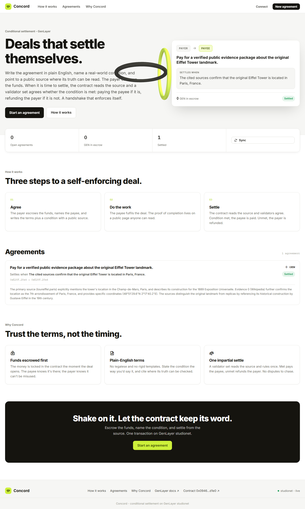
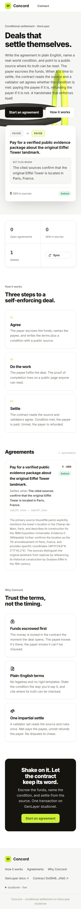

# Concord

Concord is a GenLayer conditional-settlement protocol. It turns a plain-English deal into a funded agreement that can review public evidence, settle, open a challenge window, handle appeals, and leave a permanent audit trail.

This is not a generic escrow page. Concord is built around one operational promise: fund the agreement first, define the condition clearly, and let GenLayer validators read the public source before the money moves.



## Live Deployment

| Item | Value |
| --- | --- |
| Network | GenLayer Studionet |
| Chain ID | `61999` |
| Contract | `0x0946408990Be34450e9438BeEdB9cF5f3dFAd1e0` |
| Contract Explorer | https://explorer-studio.genlayer.com/contracts/0x0946408990Be34450e9438BeEdB9cF5f3dFAd1e0 |
| Deploy TX | `0xb370e96c7f764f30d2e1c54a14b6fad6e20e93ae43720f50b7dc6e2d42abe259` |
| Deployed | `2026-06-23T17:58:23.231Z` |

## Product Idea

Concord is for agreements where payment depends on a real-world condition:

- a delivery page says the item arrived
- a launch page is live
- a public source confirms a milestone
- a campaign page proves that a threshold was reached
- a document or record shows whether a promised event happened

The frontend presents this as a polished agreement desk: a funded deal, a named condition, a source URL, and a settlement button. The contract carries the heavier protocol work behind it.



## Contract Surface

`contracts/concord_v2.py` is the deployed contract source.

The contract includes:

- `open_agreement` for payable escrowed agreements.
- `draft_agreement` for automation-safe non-payable agreement creation.
- `add_clause` for structured terms.
- `add_evidence` for source material.
- `open_review` and `review_agreement_with_genlayer` for validator review.
- `open_challenge_window` and `submit_challenge` for dispute intake.
- `resolve_challenge_with_genlayer` for challenge rulings.
- `submit_appeal` and `resolve_appeal_with_genlayer` for escalation.
- `settle` for the legacy-compatible settlement path used by the live app.
- `archive_agreement` for lifecycle closure.
- `recalculate_reputation` for participant scoring.

The read surface exposes agreement records, recent agreements, status indexes, party indexes, clauses, evidence, reviews, challenges, appeals, audit logs, public summaries, reputation, contributors, frontend bootstrap data, contract stats, and quality score.

## Verification Model

Concord V2 stores agreements and related records as JSON strings in GenLayer storage. The review path uses GenLayer nondeterministic web and LLM reasoning:

- `gl.nondet.web.render`
- `gl.nondet.exec_prompt`
- `gl.eq_principle.prompt_comparative`

The contract normalizes model responses into strict settlement fields: `outcome`, `confidenceBps`, `paymentBps`, `qualityBps`, `summary`, `rationale`, `riskFlags`, and source scoring. Evidence text is treated as untrusted data, and prompts explicitly guard against instructions embedded inside evidence pages.

## Smoke Trail

The deployed Studionet smoke run finalized the full agreement lifecycle:

| Step | Transaction |
| --- | --- |
| `set_concord_standard` | `0xab738d550bc4dda5992171e3551351a035ccc357c947ce05f44b6258a02a521b` |
| `draft_agreement` | `0x08be9b7f86da495f6a226f50f538d1fc491a92b9f0d5e1dca3527fce8a68abd9` |
| `add_clause` | `0xf6d5c5d50dda71d9b6e84b6f403ec698dcbdd7795ceb1434208122ab3ac6bfe5` |
| `add_evidence` wiki | `0x30ddea2873004560981567c62f442a6b70ee4d9f28bc937377719d6ad193f490` |
| `add_evidence` encyclopedia | `0xe865e0dd0e41edca0a87457c73820b01f1aa3893cefcba52833eca43306b8e7e` |
| `open_review` | `0x3ec0976da61a32de3bc0bfc5aeb91168f348952c224b9367ce2626bc5a244dea` |
| `review_agreement_with_genlayer` | `0x85ae8758f1bf7e69766900ba682ee27ee31aea2d662698727c0b89f7766d0a60` |
| `open_challenge_window` | `0x1c5ab960198a53995619b76a38fd2b20935b2398e440107092332297d56fe031` |
| `submit_challenge` | `0xe570583d10c6877674205d96a5fa539fee3c869c2c3c03e3bf95917d0410a327` |
| `resolve_challenge_with_genlayer` | `0x1d28ee6fcfb6ccc62a21a4ee81374f2ac248c97635e87ac93d4a3b6bb2300702` |
| `submit_appeal` | `0xa63f28d2efaaa1f8a21b33444dbb859677bf333b8e983d4162ab03fbbfa05a7e` |
| `resolve_appeal_with_genlayer` | `0xc17ea5b39f07dea79ef071eb90e2862034df2387ffb29c3f6007923aa661423d` |
| `settle` | `0x4f4c2215b5a98ce510dd94f130d4c051726236f87dc1a8dd3904cf26692c50f5` |
| `archive_agreement` | `0xcb10c54e9b158171b25463c359e2aed43acb5c3149fa3f74806c6ea562c049e3` |
| `recalculate_reputation` | `0xea51e8e6eab5e695d2a383cb92257ed2ba17f07d9e49f31eb1c294c905e5669e` |

## Repository Layout

```text
public/index.html              Static settlement desk served by Vercel
public/styles.css              Light fintech UI and agreement drawer styling
public/app.js                  Studionet reads/writes and Three.js ring animation
public/shared/genlayer-lite.js Browser-only GenLayer helper
contracts/concord_v2.py        Deployed GenLayer contract source for review
deployment.json                Public deployment and smoke metadata
vercel.json                    Production security headers
```

## Local Development

```powershell
npm install
npm run dev
```

Open:

```text
http://localhost:4802
```

The app uses browser ES modules and CDN imports, so serve `public/` over localhost instead of opening the HTML file directly.

## Production Deploy

Concord is deployed as a static Vercel project.

Recommended Vercel settings:

| Setting | Value |
| --- | --- |
| Framework Preset | Other |
| Build Command | None |
| Output Directory | `public` |
| Environment Variables | None required |

## Security Notes

- No private keys, seed phrases, vault files, or wallet exports belong in this repo.
- The included addresses and transaction hashes are public Studionet metadata.
- Writes require a connected injected wallet and explicit confirmation.
- Production headers are defined in `vercel.json`.
- Evidence URLs are opened externally with `rel="noopener"`.

Run the local safety check before pushing:

```powershell
npm run security:scan
```
